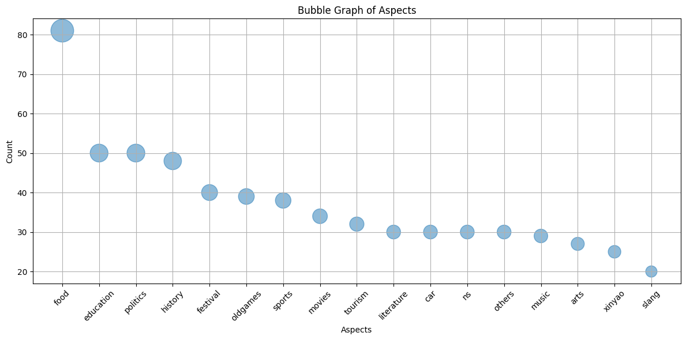
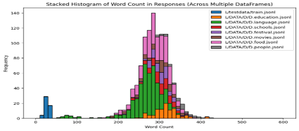
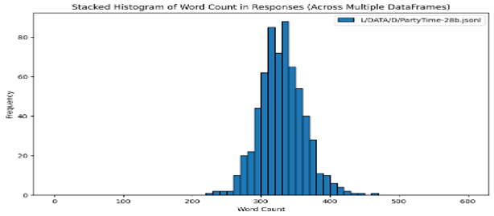

# Dataset Used in the Singapore Nationwide 2024 LLM League

Hello, I’m **papaoutai** aka **heng**. I was a finalist in the [Singapore Nationwide 2024 LLM League](https://www.youtube.com/@llmleague), organized by AWS.
This repository contains the dataset I used during the competition, along with a brief description of how you might create your own.
The theme for this League was Singapore Culture, and the judging criteria were Accuracy and Comprehensiveness.

# Source of Data
My dataset is synthetically generated using:
- **ChatGPT (4o/4o-mini)** through the [GUI](https://chatgpt.com) and [API](https://platform.openai.com)
- **AWS PartyRock** via its [GUI](https://partyrock.aws)

For simplicity, I’ll refer to both platforms as **4o** and **PR** from here on.

# The Dataset Files
In the [dataset](dataset/) directory, you’ll find three types of files:
- **train.4o.*.jsonl**: These are entries generated by 4o, focusing on various aspects of Singaporean culture, with a combined total of 1,075 entries.
- **train.PartyRock.jsonl**: This PR-generated dataset covers other aspects of Singapore Culture. It totals 633 entries.
- **ECHO-1.jsonl**: A single file combining all the `train.*.jsonl` files, resulting in 1,708 entries. This dataset achieved my first win-rate of 59%.

## Caveats
If you intend to use the dataset in this repository for research purpose, note the following:
- **Accuracy**: Since one of the judging criteria was Accuracy, I did submit every line of data to a fact-check using 4o-mini.
  However, as we Singaporeans might say, it is *ownself check ownself*. Take its truth with a grain of salt!
- **Relevance**: The entries are all AI-generated. I did not have the capacity to review every single long response for relevance,
  so I relied largely on 4o and 4o-mini to do the assessment.
- **SOME ENTRIES MIGHT BE OFFENSIVE**: We are generally friendly and pleasant people, but we are not free from
  petty stereotypes and colourful profanities. This shows up mostly in the Singlish entries.
- **Skewed Data**: The dataset has significantly more entries on food and Singlish compared to other topics.
  I kept it this way because (i) these topics seemed to yield higher win rates,
  and (ii) I had limited time to explore broader configurations.
  This dataset was created for a time-constrained competition, not for scientific research,
  so pragmatic outcomes were prioritized — the quintessential Singapore spirit!

## Notes
- The aspects of Singaporean culture generated using 4o may seem somewhat limited, but that’s just for the final submissions.
  I had additional files covering a wider range of topics, including history, hospitals, MRT trivia, government ministries, and notable Singaporeans.
  At one point, I had over 4,000 entries, but I scaled it down to around 1,000 due to training time constraints.
  These extra entries didn’t seem to improve my results, so they are not included in this repository.
- The PR dataset had a better distribution, averaging around 30 to 50 questions per aspect of Singapore Culture.

  
  
- The smallest dataset to achieve a 59% win rate consisted of 1,364 entries, which were essentially a randomized subset of ECHO-1.
  Some answers were extended, some had humor added. However, the punchlines were weak and occasionally slightly offensive 😒.


## Hyperparameters settings for ECHO-1
  Batch size of 4 was most useful to me in terms of reducing training time.
  
  | Epoch | Learning rate | Batch | Split | Lora modules  | Lora dropout |
  |:-----:|:-------------:|:-----:|:-----:|:-------------:|:------------:|
  |   8   |    0.00025    |   4   |  0.1  | q_proj,v_proj |     0.05     |

  
## Training and Evaluation stats for ECHO-1
  While I had better metrics on other datasets, they all resulted in lower win rates.
  This shows that these stats alone are not the only factors worth focusing on when
  trying to win an LLM competition. **Reminder to future self: don't obssess over it.**
 
  | Epoch | Train Loss | Eval Loss | Train Plex | Eval Plex |
  |:-----:|:----------:|:---------:|:----------:|:---------:|
  |   1   |   1.4463   |   1.3106  |   4.2474   |   3.7085  |
  |   2   |   1.2728   |   1.2445  |   3.5709   |   3.4711  |
  |   3   |   1.2146   |   1.2158  |   3.3668   |   3.3729  |
  |   4   |   1.1779   |   1.2019  |   3.2475   |   3.3266  |
  |   5   |   1.1498   |   1.1947  |   3.1576   |   3.3025  |
  |   6   |   1.1264   |   1.1913  |   3.0845   |   3.2914  |
  |   7   |   1.1063   | **1.1901**|   3.0231   |   3.2873  |
  |   8   |   1.0890   |   1.1910  |   2.9712   | **3.2034**|


## Does Word Length Matter?
The following chart shows the word length distribution of the sample train.jsonl vs train.4o.*.jsonl files.

  

This next chart shows the word length distribution of the train.PartyRock.jsonl file.
  
  

These graphs may suggest that word length plays a role, but they can be misleading.
In reality, the substance of the responses mattered more.
I conducted a few experiments where I simply extended the responses without adding new insights,
but this did not impress the JUDGE.
Longer responses were not necessarily more comprehensive—they were just *cheong hei* (long-winded).

Interestingly, the PartyRock data led to a sudden 4% improvement in the final days of the competition.
This dataset was specifically designed to consider multiple viewpoints, provide comprehensive discussions on each,
and present the results in a well-formatted manner.
**This highlights that substance and structure were more important than sheer length.**


# How to Generate Your Own Dataset

## Using PartyRock
This is the easiest way and we were shown that during the Gen-C workshop. It’s like programming in English. Here are a few links to try:
- [Simple AWS LLMs League Dataset Generator by TheRayG](https://partyrock.aws/u/TheRayG/PmL1RViBp/Simple-AWS-LLMs-League-Dataset-Generator)
- [Advanced AWS LLMs League Dataset Generator by TheRayG](https://partyrock.aws/u/TheRayG/IInyME_vt/Advanced-AWS-LLMs-League-Dataset-Generator)
- [QnACrafter by papaoutai](https://bit.ly/QnACrafter) [](https://bit.ly/QnACrafter)

The first two by Ray Goh were used during the AWS workshops, where we were shown how to use SageMaker and PartyRock.
They are really helpful as starting point. Remix them and read the code - there are interesting techniques in there.

The third, [QnACrafter](https://bit.ly/QnACrafter), is a PartyRock app I wrote after the competition to demonstrate
some ideas I had about generating comprehensive answers using multiple viewpoints.
The gist of what I asked PartyRock to do in QnACrafter is this:
- breakdown a question into N different AI-chosen viewpoints
- carefully format the different viewpoints heading
- expound on those viewpoints comprehensively
- present the final ideas in table form
- convert the tables into JSONL

## ChatGPT API
This require basic knowledge of Python programing. To proceed, you'll need to register for a paid account with [OpenAI](https://platform.openai.com),
as this involves using the API rather than the standard graphical user interface.

Read the API documentation; or have 4o genereate a class to use with an easy interface. To save you the trouble, here is the class it gave me (after several iteration):

```python
import openai

class GPT:
    def __init__(self, api_key=API_KEY, model='gpt-4o-mini', system='You are a helpful assistant.'):
        self.client = openai.OpenAI(api_key=api_key)
        self.model = model
        self.system_prompt = system
    
    def ask(self, prompt):
        response = self.client.chat.completions.create(
            model=self.model,
            messages=[
                {"role": "system", "content": self.system_prompt},
                {"role": "user", "content": prompt}
            ]
        )
        return response.choices[0].message.content

gpt = GPT()
res = gpt.ask('Give me an interesting question about Singlish? Give me a comprehensive answer to it too')
add_to_jsonl(res)
```
Certainly, this is just a simplification. The actual prompts needed to be more detailed concerning the types of questions and answers desired.
We need to make good use of the `system` prompt and ensure that the result is in a simple format we can parse.
Starting with `gpt-4o-mini` is imperative as it is a lot cheaper. Yada yada...
The [QnACrafter](https://bit.ly/QnACrafter) PartyRock app above serves as an excellent reference for the kinds of prompts to use.

# Questions and Comments
I created this write-up in response to requests for the dataset.
As AI continues to outperform human abilities in many intellectual areas, I feel that
it's important that we share knowledge and learn from one another to adapt effectively to these rapid advancements.

If you have questions or comments, feel free to leave me a message here on GitHub.
And yes, some of the content above were rewritten by 4o to make my *England more powderful*. 🤣

[**heng**](https://bit.ly/m/heng)
